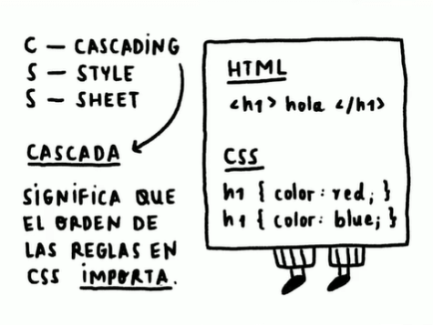
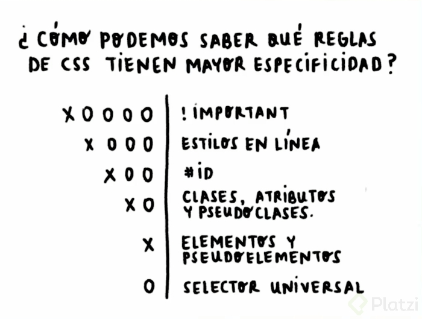

# Cascada y especificidad en CSS
---
## Qué es cascada
Es el concepto que determina **qué estilos se colocan sobre otros**, priorizando a aquellos que se encuentren más abajo del código. CSS es la abreviación de Cascade Style Sheets (hojas de estilos en Cascada).

## Qué es especificidad
La especificidad consiste en dar un valor a una regla CSS sobre qué tan específico es el estilo, esto para que los navegadores puedan saber qué estilos aplicar sobre otros, independientemente de dónde se encuentren en el código. El estilo se aplicará donde la especificidad sea mayor.

## Tipos de especificidad
Existen 6 tipos de especificidad con su respectivo valor, donde X es la cantidad de estilos que lo contienen. Mira la siguiente imagen:

---

📩 <a href="https://specificity.keegan.st">calculadora de especificidad<a>
🗂️ <a href="https://developer.mozilla.org/en-US/docs/Web/CSS/Specificity">Manual reference<a>