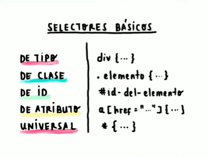
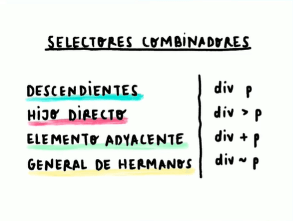

# Selectores
---
## Básicos
Un selector básico es la mínima expresión CSS para colocar estilos.

## Combinadores
Un selector combinador es la unión de dos o más selectores básicos.

## Pseudoclases
Nos permite llegar a aquellas acciones que hace el usuario.

## Pseudoelementos
Nos permiten acceder a elementos de HTML que no son accesibles con los selectores ya vistos.

| Pseudoclases        | Pseudoelemento        |
|---------------------|-----------------------|
|  :active            | ::after               |
|  :focus             | ::before              |
|  :hover             | ::first-letter        |
|  :nth-child(n)      | ::placeholder         |
---
🗂️ Manual reference <a href="https://developer.mozilla.org/en-US/docs/Web/CSS/Pseudo-elements">🛎️<a>